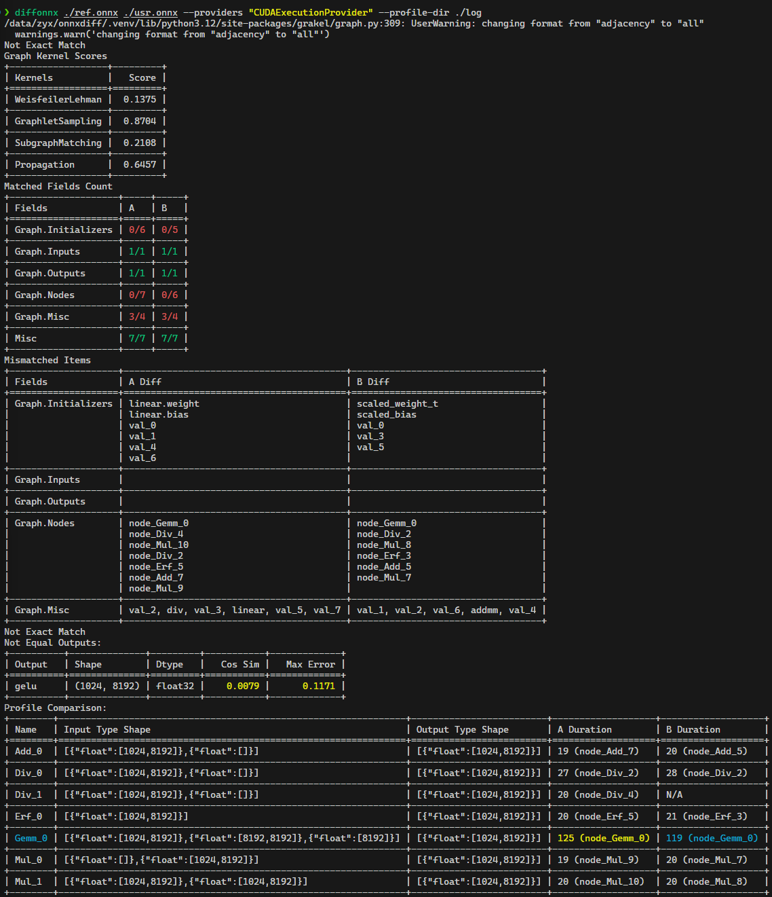

# Diff your ONNXs

A **powerful yet playful** tool to **compare and analyze ONNX models** – whether you're hunting for hidden changes or debugging mysterious outputs. Think of it as a microscope for your pair of models, complete with structure analysis and runtime sanity checks.

## 🚀 Installation

```bash
pip install "grakel @ git+https://github.com/yuxuan-z19/GraKeL@zyx-dev"
pip install diffonnx        # CPU version
pip install "diffonnx[gpu]" # GPU version
```

Or if you’re the DIY type:

```bash
git clone https://github.com/yuxuan-z19/diffonnx.git
cd diffonnx && pip install -e .
```

## 🔍 X-ray vision for ONNX models

DiffONNX acts like an X-ray for your ONNX models — it pinpoints runtime hotspots with high precision, helping you quickly identify performance bottlenecks across different backends.

### 🧠 Static Analysis

- Full ONNX graph comparison (nodes, edges, initializers, etc.)
- Graph kernel similarity scores based on [GraKel](https://github.com/ysig/GraKeL)
- Operator statistics and diff
- Comparison after model simplification

##### ❓ Why These Kernels?

We chose the following four kernels because they **offer strong structural sensitivity, good scalability, and semantic insight**, all critical for comparing ONNX models in optimization, verification, and architecture evolution.

| Kernel                | Strengths                                 | Focus                |
| --------------------- | ----------------------------------------- | -------------------- |
| **Weisfeiler-Lehman** | Fast, captures subtle structural changes  | Global structure     |
| **Graphlet**          | Highlights local connection patterns      | Local structure      |
| **Subgraph Matching** | Detects reused or rewritten modules       | Block-level changes  |
| **Propagation**       | Combines topology with operator semantics | Semantic differences |

Together, they provide a **balanced and interpretable toolkit** for robust ONNX model analysis.

### ⚡ Runtime Analysis

- Cosine / angular similarity of tensor outputs
- Maximum absolute error inspection
- Precision breakdowns
- Operator performance microscopy (along with [`torch.fx` IR](https://docs.pytorch.org/docs/stable/fx.html#torch.fx.Graph))
- Supports multiple execution providers (CPU, CUDA, anything ONNXRuntime speaks)

---

##### ⚠️ Note on Using `onnxsim.simplify`


This tool is designed to compare ONNX models at both the **structural** and **runtime** levels. To ensure the analysis remains accurate and traceable, **we strongly recommend against using `onnxsim.simplify` before comparison**.

While `onnxsim.simplify` can be helpful for model deployment and optimization, it performs structural transformations leading to **potential renaming or removing intermediate nodes**. These changes may:

- Break one-to-one correspondence between nodes in two models
- Obscure the origin of certain operations
- Distort static graph topology
- Alter runtime profiling results

---

## 🛠 Usage

### CLI: For Fast Hands-On Nerding

```bash
# Basic comparison
diffonnx ref_model.onnx usr_model.onnx

# Verbose mode – unleash the diff dragon
diffonnx ref_model.onnx usr_model.onnx -v
```



### Python API: For People Who Think in Code

```python
import onnx
from diffonnx import MainDiff, StaticDiff, RuntimeDiff

ref = onnx.load("ref_model.onnx")
usr = onnx.load("usr_model.onnx")

# Full analysis, max drama
diff = MainDiff(ref, usr, verbose=True)
static_result, runtime_result = diff.summary(output=True)

# Just structure? Sure
static_only = StaticDiff(ref, usr)
static_result = static_only.summary(output=True)

# Runtime only, CUDA powered
runtime_only = RuntimeDiff(
    ref, usr, providers=["CUDAExecutionProvider"]
)
runtime_result = runtime_only.summary(output=True)
```

> We discourage

### Quick Graph Kernel Scores

For users who want a simple, unified interface to compute multiple graph kernel similarities at once, we provide the handy `GraphDiff` class. It bundles the kernels and returns their scores in one call:

```python
from grakel.graph import Graph
from diffonnx.static import GraphDiff

# graph_a = Graph()
# graph_b = Graph()

graph_diff = GraphDiff(verbose=True)
graph_diff.add_kernels(
    [
        ShortestPath(normalize=True, with_labels=False),
        RandomWalkLabeled(normalize=True),
    ]
)
graph_diff.remove_kernels([WeisfeilerLehman()])

scores = graph_diff.score(graph_a, graph_b)
print(scores.keys())
# Example output:
# {'GraphletSampling', 'SubgraphMatching', 'Propagation', 'ShortestPath', 'RandomWalkLabeled'}
```

This way, you can easily evaluate graph similarity across multiple kernels without manually instantiating each one.

## 📊 Output Breakdown

```python
@dataclass
class StaticResult:
    # Is the structure identical?
    exact_match: bool
    
    # Similarity score (0 to 1, higher = happier)
    score: Score
    
    # Detailed matching info
    graph_matches: Dict[str, Matches] 

    # Model-level attribute differences
    root_matches: Dict[str, Matches]
```

```python
@dataclass
class RuntimeResult:
    # Are the outputs exactly the same?
    exact_match: bool

    # Inputs that are invalid (shape/dtype mismatch).
    invalid: Dict[str, Accuracy]

    # Outputs that are exactly the same.
    equal: Dict[str, Accuracy]

    # Outputs that are not exactly the same but have the same shape and dtype.
    nonequal: Dict[str, Accuracy]

    # Outputs that have shape/dtype mismatch.
    mismatched: Dict[str, Accuracy]
```

Check `diffonnx.structs` for more about `Matches` and `Accuracy`.

## 👷 Development

If you're contributing or running tests, we recommend using `uv` — a faster, modern Python package manager.

```bash
git clone https://github.com/yuxuan-z19/diffonnx.git
cd diffonnx

# Install dev dependecies (CPU)
uv sync --locked --all-groups --extra torch-cpu
# Install dev dependencies (CUDA 12.4)
uv sync --locked --all-groups --extra torch-cu124

# Run tests
uv run pytest -n auto
```

### ⚠️ Known Issues

This section tracks known issues and their resolution status. Some are external, others have been patched *(marked)* in this repo.

#### `GraKel` related

We recommend using the [built-from-source](https://github.com/ysig/GraKeL) version of `GraKeL` rather than the latest PyPI release.

- [ ] Import failure due to NumPy issue ([GraKel#115](https://github.com/ysig/GraKeL/issues/115))

    - Fixes have been [merged](https://github.com/ysig/GraKeL/pull/116),  pending official release.

- [ ] Output shape issue in `SubgraphMatching` ([GraKel#124](https://github.com/ysig/GraKeL/pull/124))

#### `onnxruntime` related

- [ ] CUDAExecutionProvider not available on some NVIDIA setups ([onnxruntime#7748](https://github.com/microsoft/onnxruntime/issues/7748))

    - Install in two steps:

        ```bash
        pip install onnxruntime
        pip install "onnxruntime[cuda,cudnn]"
        ```

- [x] Missing `libcudnn.so.9` in `LD_LIBRARY_PATH` [onnxruntime#25609](https://github.com/microsoft/onnxruntime/issues/25609)

    - Fixed via `_patch_cudnn_ld_lib_path` (applied in `RuntimeDiff._prepare_providers`)

        ```python
        if "CUDAExecutionProvider" in providers:
            _patch_cudnn_ld_lib_path()
        self.providers = providers + default_provider
        ```